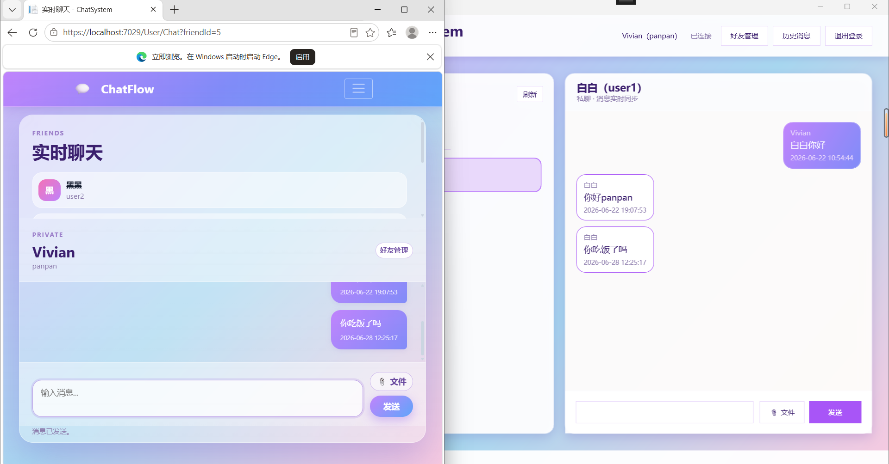

# ChatSystem 网上沟通交流系统

ChatSystem 是一个基于 .NET 8 的即时沟通系统，包含 Web 端和 Windows 桌面端。Web 端使用 ASP.NET Core Razor Pages、SignalR、EF Core 和 SQLite，桌面端使用 WPF，通过 REST API 和 SignalR 与服务端通信。

## 功能概览

- 用户注册、登录、退出
- 管理员审核注册用户、用户管理、消息管理
- 好友列表、好友申请、同意或拒绝好友请求
- 私聊实时消息、历史消息查看、用户删除自己的消息
- 群聊创建、邀请好友入群、移出成员、退出或解散群
- 私聊和群聊文件发送、文件下载
- Web 端和 WPF 桌面端实时同步消息
- 未读消息提示和无刷新消息追加

## 界面展示

### 实时聊天同步



### 群聊界面


### 私聊文件发送


## 技术栈

| 模块 | 技术 |
| --- | --- |
| 服务端 | ASP.NET Core 8.0、Razor Pages、Web API |
| 实时通信 | SignalR |
| 数据访问 | Entity Framework Core 8.0、SQLite |
| 桌面端 | WPF、.NET 8 Windows |
| 前端资源 | Bootstrap、jQuery |
| 数据库迁移 | dotnet-ef |

## 项目结构

```text
ChatSystem/
├── ChatSystem.sln
├── NuGet.Config
├── Data/
│   └── main.sql
├── src/
│   ├── ChatSystem.Core/       # 实体和枚举
│   ├── ChatSystem.Server/     # Web 服务端、Razor Pages、API、SignalR
│   └── ChatSystem.Desktop/    # WPF 桌面客户端
├── README.md
└── 提交清单.md
```

## 环境要求

- Windows 10/11
- .NET 8 SDK
- Visual Studio 2022，需安装 ASP.NET 和桌面开发相关工作负载

## 运行方式

### Visual Studio

1. 使用 Visual Studio 打开 `ChatSystem.sln`。
2. 右键解决方案，选择“属性”。
3. 在“通用属性 / 启动项目”中选择“多个启动项目”。
4. 将 `ChatSystem.Server` 和 `ChatSystem.Desktop` 都设置为“启动”。
5. 点击启动运行。

Web 服务默认地址：

```text
http://127.0.0.1:5098
```

桌面端登录页的服务器地址也填写：

```text
http://127.0.0.1:5098
```

### 命令行

```powershell
dotnet restore
dotnet build ChatSystem.sln
dotnet run --project src\ChatSystem.Server\ChatSystem.Server.csproj
```

另开一个终端运行桌面端：

```powershell
dotnet run --project src\ChatSystem.Desktop\ChatSystem.Desktop.csproj
```

## 默认账号

管理员账号：

```text
用户名：admin
密码：Admin123!
```

普通测试账号：

```text
用户名：user1
密码：123456

用户名：user2
密码：123456

用户名：user3
密码：123456
```

项目启动时会自动检查并初始化 SQLite 数据库。如果 `Data/chat.db` 不存在，系统会自动创建数据库并写入默认账号和演示数据。

## 数据库说明

- 运行时数据库文件：`Data/chat.db`
- 数据库结构参考：`Data/main.sql`
- EF Core 迁移文件：`src/ChatSystem.Server/Data/Migrations/`

`Data/chat.db` 属于本地运行数据，不建议提交到 GitHub。其他开发者克隆项目后直接运行服务端即可自动生成。
